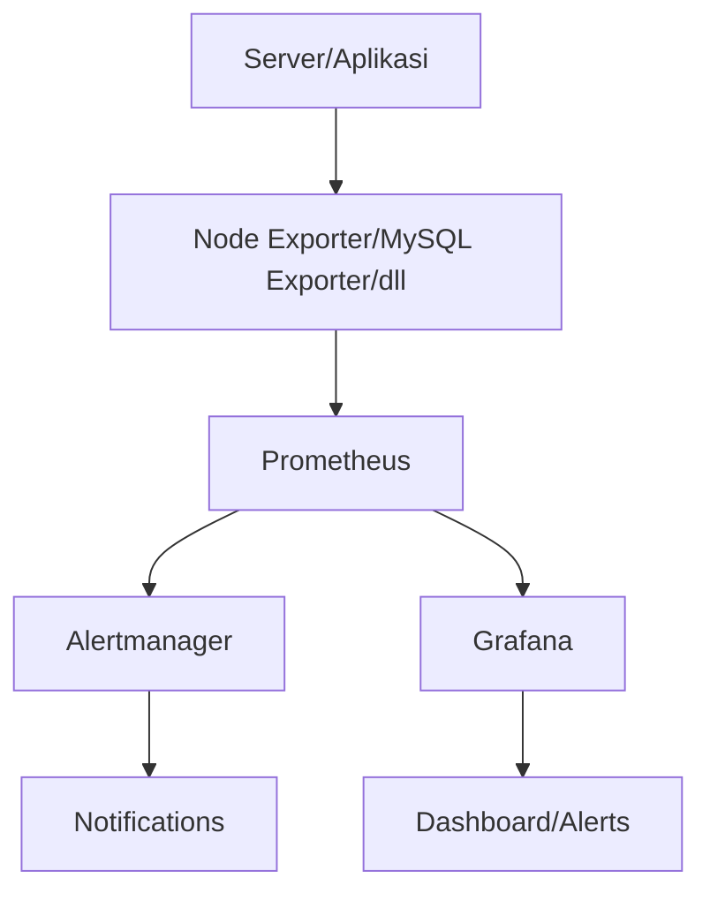

# Server Performance Monitoring and Visualization
Server performance monitoring system for CPU, memory, disk usage, and statistics for web servers (Nginx) and databases (MySQL). Using Prometheus for metrics collection, Grafana for visualization, and Netdata for real-time monitoring.

## Usage
| # | Services | Links |
|---|---|--- |
| Host | VMWare Workstation 17 Pro | <https://vmware.com/> |
| Distro | Ubuntu 22.04 LTS | <https://ubuntu.com> |
| Services | Nginx | <https://nginx.org> |
|| Secure Shell / SSH | <https://ssh.com> |
|| Prometheus | <https://prometheus.io> |
|| Grafana | <https://grafana.com> |
|| Netdata | <https://netdata.cloud> |

## Getting Started

### Initialization
> Apa itu Nginx? Sebuah service web server yang dapat digunakan sebagai port forwarding, load balancer, sekaligus mail proxy.

> Apa itu MySQL? Merupakan database yang sangat populer yang berfungsi untuk menyimpan data dan memanage data berbasiskan relational database management system.
 

### Grafana
> Apa itu Grafana? Adalah tools untuk memvisualisasikan data bahkan alerting ditambah dengan keunggulan open source dan customable.

### Prometheus
> Apa itu Prometheus? Sistem monitoring infrastruktur server ataupun aplikasi, tools yang populer karena fleksibilitas dan integrasi dengan banyak platform.


### Netdata
> Apa itu Netdata? Netdata merupakan tools monitoring real-time untuk melihat resources pada server.

## Flow



## Running Public

1. Menjalankan Grafana
```ssh -R 80:localhost:3000 serveo.net```

2. Menjalankan Prometheus
```ssh -R 80:localhost:9090 serveo.net```

3. Menjalankan Netdata
```ssh -R 80:localhost:19999 serveo.net```


> Coming Soon!
