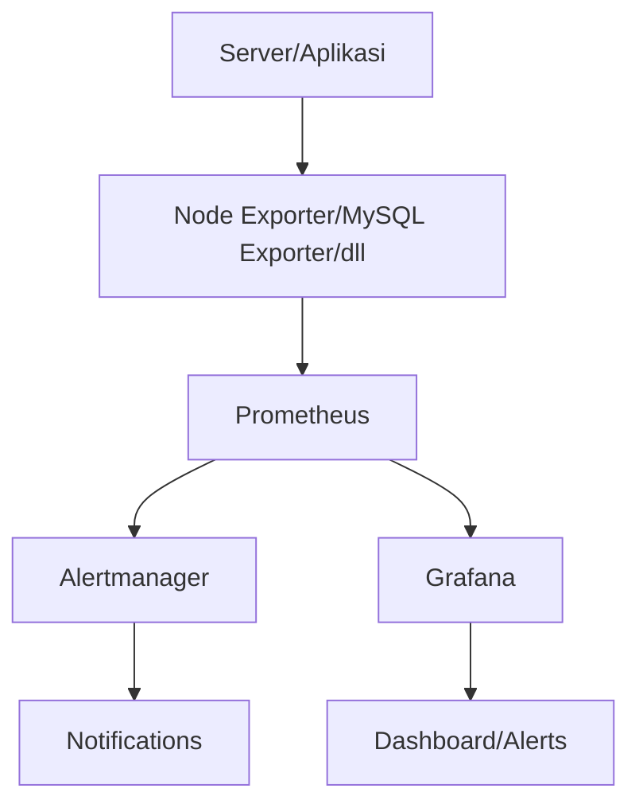

# Server Performance Monitoring and Visualization
Server performance monitoring system for CPU, memory, disk usage, and statistics for web servers (Nginx) and databases (MySQL). Using Prometheus for metrics collection, Grafana for visualization, and Netdata for real-time monitoring.


---
## Usage
| # | Services | Links |
|---|---|--- |
| Host | VMWare Workstation 17 Pro | <https://vmware.com/> |
| Distro | Ubuntu 22.04 LTS | <https://ubuntu.com> |
| Services | Nginx | <https://nginx.org> |
|| Secure Shell / SSH | <https://ssh.com> |
|| Prometheus | <https://prometheus.io> |
|| Grafana | <https://grafana.com> |
|| Netdata | <https://netdata.cloud> |


---
## Getting Started

1. Cek IP Address
   
   
3. Update Packages
   
   
4. Install Packages()
   


---
### Initialization
#### Nginx as Web Service

> Apa itu Nginx? Sebuah service web server yang dapat digunakan sebagai port forwarding, load balancer, sekaligus mail proxy.

1. Install Nginx
   
   
2. Start & Enable Nginx
   


#### MySQL as Database

> Apa itu MySQL? Merupakan database yang sangat populer yang berfungsi untuk menyimpan data dan memanage data berbasiskan relational database management system.

3. Install MySQL
   
  
4. Start & Enable MySQL
   

   
---
### Prometheus

> Apa itu Prometheus? Sistem monitoring infrastruktur server ataupun aplikasi, tools yang populer karena fleksibilitas dan integrasi dengan banyak platform.

1. Buat pengguna prometheus


2. Buat direktori


3. Download Prometheus


4. Extract file prometheus


5. Salin file prometheus ke folder bin


6. Salin konfigurasi consoles ke direktori prometheus


7. Buat file konfigurasi prometheus


8. Buat file service prometheus


> Apa itu Node Exporter?

9. Install node exporter


11. Extract file node exporter


12. Salin file node expoerter ke folder bin


13. Buat file service node exporter


> Apa itu MySQL Exporter?

13. Download mysql exporter


15. Extract file mysql exporter


16. Salin file mysql exporter ke direktori bin


17. Buat akses ke user exporter


18. Buat file konfigurasi mysql exporter


19. Buat file service mysql exporter


---
### Grafana
> Apa itu Grafana? Adalah tools untuk memvisualisasikan data bahkan alerting ditambah dengan keunggulan open source dan customable.

1. Tambahkan Grafana gpg


2. Tambahkan repository Grafana


3. Update repository


4. Install Grafana


5. Running Grafana


---
### Netdata
> Apa itu Netdata? Netdata merupakan tools monitoring real-time untuk melihat resources pada server.

1. Install Netdata

  
2. Proses install Netdata


3. Berhasil install Netdata


---
## Flow



## Running Public

1. Menjalankan Grafana
```ssh -R 80:localhost:3000 serveo.net```

2. Menjalankan Prometheus
```ssh -R 80:localhost:9090 serveo.net```

3. Menjalankan Netdata
```ssh -R 80:localhost:19999 serveo.net```


> Coming Soon!
