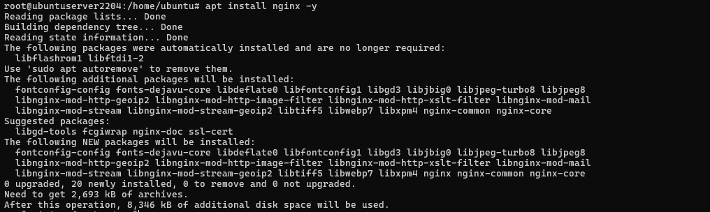
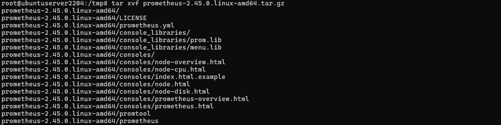
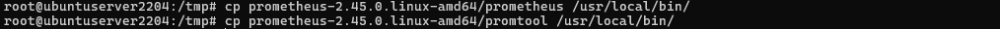
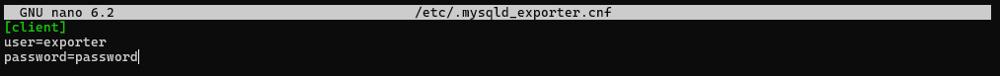
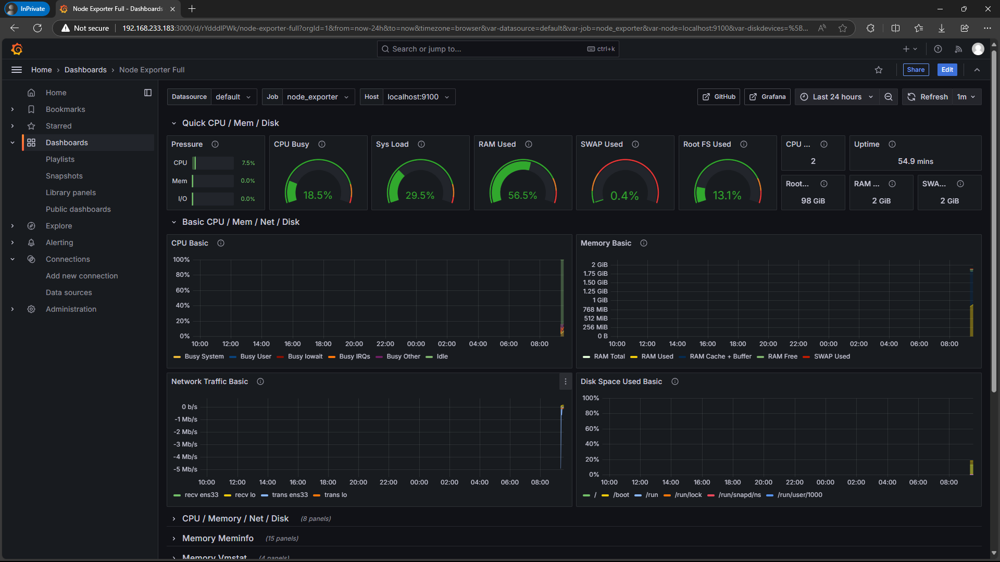

# Server Performance Monitoring and Visualization
Server performance monitoring system for CPU, memory, disk usage, and statistics for web servers (Nginx) and databases (MySQL). Using Prometheus for metrics collection, Grafana for visualization, and Netdata for real-time monitoring.


---
## Usage
| # | Services | Purpose | Links |
|---|---|---|---|
| Host | VMWare Workstation 17 Pro | Virtualization | <https://vmware.com/> |
| Distro | Ubuntu 22.04 LTS | Operating System | <https://ubuntu.com> |
| Services | Nginx | WebServer | <https://nginx.org> |
|| MySQL | Database | <https://mysql.com> |
|| Secure Shell / SSH | Secure Access | <https://ssh.com> |
|| Prometheus | Metrics Collection | <https://prometheus.io> |
|| Grafana | Data Visualization | <https://grafana.com> |
|| Netdata | Real-time Monitoring | <https://netdata.cloud> |


---
## Getting Started

1. Cek IP Address


2. Update Packages

   
3. Install Packages


---
### Initialization
#### Nginx as Web Service

> _Apa itu Nginx? Sebuah service web server yang dapat digunakan sebagai port forwarding, load balancer, sekaligus mail proxy._

1. Install Nginx

   
2. Start & Enable Nginx


#### MySQL as Database

> _Apa itu MySQL? Merupakan database yang sangat populer yang berfungsi untuk menyimpan data dan memanage data berbasiskan relational database management system._

3. Install MySQL

  
4. Start & Enable MySQL


   
---
### Prometheus

> _Apa itu Prometheus? Sistem monitoring infrastruktur server ataupun aplikasi, tools yang populer karena fleksibilitas dan integrasi dengan banyak platform._

1. Buat pengguna prometheus


2. Buat direktori


3. Download Prometheus


4. Extract file prometheus


5. Salin file prometheus ke folder bin


6. Salin konfigurasi consoles ke direktori prometheus


7. Buat file konfigurasi prometheus


8. Buat file service prometheus


> _Apa itu Node Exporter? Merupakan service yang berfungsi untuk mengumpulkan resources pada node yang sedang running._

9. Install node exporter


11. Extract file node exporter


12. Salin file node expoerter ke folder bin


13. Buat file service node exporter


> _Apa itu MySQL Exporter? Secara sederhana adalah merupakan service yang digunakan untuk menampilkan resources dari mysql agar dapat divisualisasikan menjadi grafik._

13. Download mysql exporter


15. Extract file mysql exporter


16. Salin file mysql exporter ke direktori bin


17. Buat akses ke user exporter


18. Buat file konfigurasi mysql exporter


19. Buat file service mysql exporter


---
### Grafana
> _Apa itu Grafana? Adalah tools untuk memvisualisasikan data bahkan alerting ditambah dengan keunggulan open source dan customable._

1. Tambahkan Grafana gpg


2. Tambahkan repository Grafana


3. Update repository


4. Install Grafana


5. Running Grafana


---
### Netdata
> _Apa itu Netdata? Netdata merupakan tools monitoring real-time untuk melihat resources pada server._

1. Install Netdata

  
2. Proses install Netdata


3. Berhasil install Netdata


---
### More Configuration

> _Set permission? penggunaan chown bertujuan untuk memberikan hak kepemilikan folder atau file kepada user._

1. Buat akses untuk user prometheus


2. Reload systemd


3. Jalankan services prometheus, node_exporter, mysql_exporter


---
## Flow


---
## Running Public

1. Menjalankan Grafana
   ```
   ssh -R 80:localhost:3000 serveo.net
   ```

2. Menjalankan Prometheus
   ```
   ssh -R 80:localhost:9090 serveo.net
   ```

3. Menjalankan Netdata
   ```
   ssh -R 80:localhost:19999 serveo.net
   ```

---
## Testing
1. Login Grafana dengan default credential `admin:admin`


2. Cek Node yang terkoneksi berupa server `ubuntuserver2204`


3. Tampilan dashboard dari Grafana


4. Menambahkan Prometheus pada Grafana


5. Prometheus berhasil ditambahkan pada Grafana


6. Menambahkan Node Exporter ke Grafana


7. Node Exporter selesai ditambahkan ke Grafana


8. Tambah MySQL pada Source Data Grafana


9. MySQL berhasil ditambahkan


10. Menambahkan Nginx Web Server ke Grafana


11. Semua Services yang telah ditambahkan ke Grafana


12. Melakukan Login ke Prometheus


13. Login ke Netdata menggunakan guest


14. Realtime Resources pada Node Server


---
## Conclusion

Pembahasan services monitoring dengan mengimplementasikan Prometheus, Grafana, Netdata dengan beberapa services sebagai sample yang dimonitoring seperti MySQL dan Nginx. Hasil yang didapat bertujuan untuk memantau proses yang terjadi pada server, berguna untuk mendeteksi serangan ke server sehingga dapat membuat alerting untuk memberitahu bahwa ada attack ke server.
